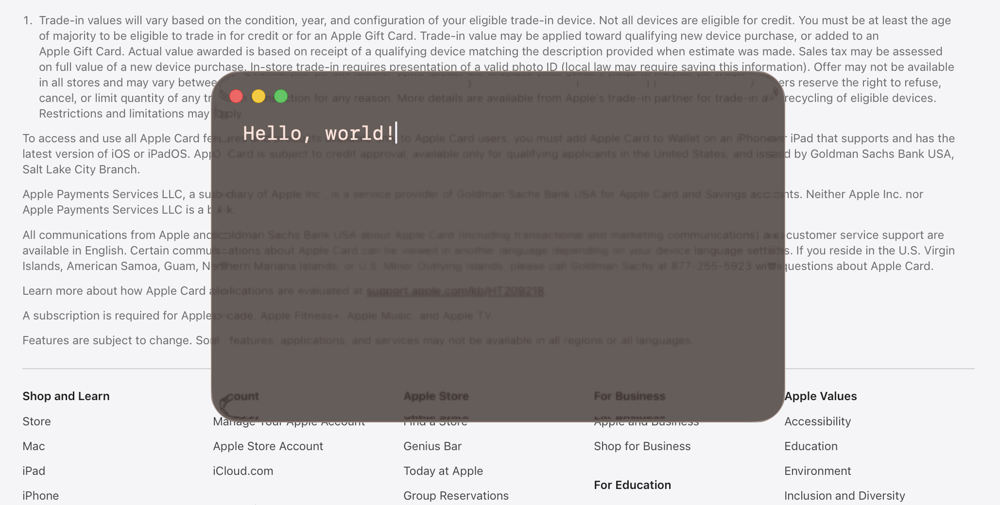
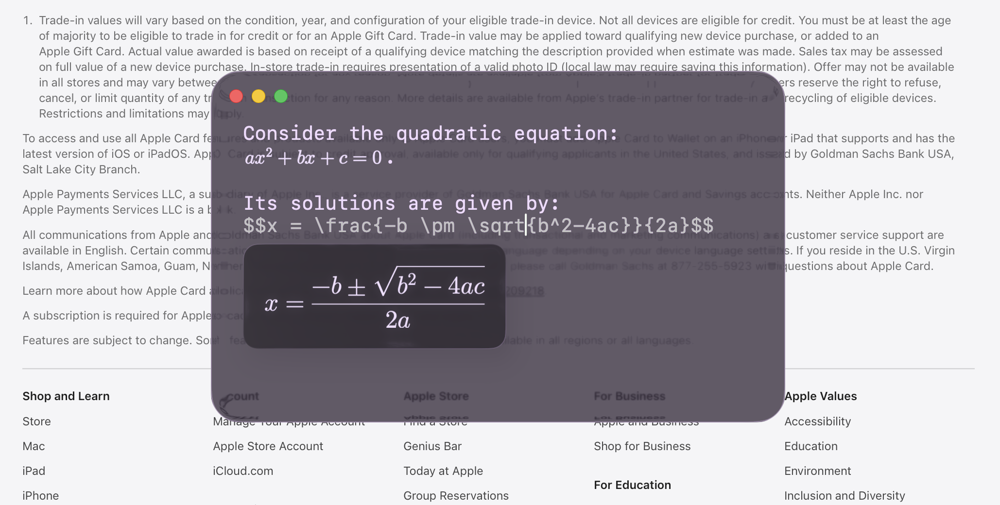

<h1 align="right">
<a href="README.md">🇺🇸</a>
<code>🇷🇺</code>
<br>
<div align="left">Jot</div>
</h1>

<p align="center">
  
</p>

<p align="center">
  Нативный «стеклянный» текстовый редактор для <b>macOS</b> с
  <b>инлайн-LaTeX</b> — весь в одном Swift-файле поверх Liquid Glass из AppKit.
</p>

<p align="center">
  
  
  
</p>

---

## О проекте

**Jot** — компактный полупрозрачный блокнот для macOS. Окно отрисовано настоящим
материалом Liquid Glass (`NSGlassEffectView`), поэтому текст «висит» над матовым
стеклом, преломляющим то, что за окном. Пишешь формулу между `$$…$$` — она
рендерится прямо по месту, пока ты печатаешь.

Проект намеренно крошечный: без Xcode-проекта, без storyboard, без asset catalog —
всё приложение это один `main.swift` плюс вшитая копия
[SwiftMath](https://github.com/mgriebling/SwiftMath) для рендеринга LaTeX.

## Возможности

- 🪟 **Стеклянное окно** — настоящий матовый glass-редактор на публичных API AppKit.
- 🧮 **Инлайн-LaTeX** — печатаешь `$$…$$`, и формула рендерится вживую через SwiftMath.
  Авто-закрытие разделителей, многострочные формулы и побайтовый round-trip исходника
  при сохранении.
- 🌈 **Rainbow Mode** — плавно перекрашивает стекло (и текст) по кругу оттенков.
- 🎛 **Настройки внешнего вида** — затемнение, насыщенность цвета, оттенок, скорость
  радуги, прозрачность текста, «поверх всех окон».
- 📐 **Перенос строк + направляющие** — ненавязчивые метки показывают, где длинная
  строка была перенесена.
- 💾 **Текстовые файлы** — открытие/сохранение с индикатором несохранённых изменений (`✶`).
- ⚡️ **Нативное и самодостаточное** — один Swift-файл, для сборки Xcode не нужен.

## Скриншоты

> _Добавь свои скриншоты в папку `assets/` (`⌘⇧4` на macOS) — пути ниже начнут
> отображаться автоматически._

<p align="center">
  
</p>
<p align="center">
  
</p>

## Инлайн-LaTeX — как это работает

1. Убедись, что включено **Format ▸ Render LaTeX Formulas**.
2. Напечатай `$$` — Jot сам достроит до `$$$$` и поставит курсор в середину.
3. Введи LaTeX, например:

   ```latex
   $$E = mc^2$$
   $$\frac{-b \pm \sqrt{b^2 - 4ac}}{2a}$$
   ```

4. Выведи курсор наружу (клик в стороне или стрелка за разделители) — формула
   отрендерится. Кликни обратно внутрь, чтобы снова редактировать исходник.

Заметки:

- **Многострочные** формулы поддерживаются (Enter внутри `$$…$$`).
- Используй `\$`, если в тексте нужен **буквальный знак доллара**.
- Точный исходник `$$…$$` сохраняется в файл как есть — ничего не обрезается и не
  переформатируется.
- Кириллица внутри формулы — только через `$$\text{…}$$` (в мат-шрифте нет кириллицы).

## Меню и горячие клавиши

| Действие      | Клавиши |
|---------------|---------|
| Open…         | ⌘O      |
| Save          | ⌘S      |
| Save As…      | ⇧⌘S     |
| Quit Jot      | ⌘Q      |

- **Format:** Font Size (слайдер), Word Wrap, Wrapped Line Guides, Render LaTeX Formulas
- **Appearance:** Always on Top, Rainbow Mode, Darkening, Color Strength, Hue, Rainbow Speed, Text Opacity

## Требования

- **macOS 26 (Tahoe) или новее.** Jot построен на API Liquid Glass
  (`NSGlassEffectView`), которых нет в более ранних версиях macOS.
- Для **сборки из исходников:** только **Command Line Tools** от Apple (`swiftc`,
  `sips`, `iconutil`, `codesign`) — полноценный Xcode _не нужен_, и **никаких внешних
  зависимостей** (ни Python, ни Homebrew).

## Установка

### Вариант A — скачать релиз

1. Возьми `Jot-x.y.dmg` со страницы [Releases](../../releases).
2. Открой его и перетащи **Jot** в **Applications**.
3. Поскольку приложение не подписано Apple Developer ID, macOS помещает его в
   карантин. Снять флаг карантина один раз:

   ```bash
   xattr -dr com.apple.quarantine /Applications/Jot.app
   ```

   (Либо: правый клик по приложению ▸ Open, или разрешить его в
   **System Settings ▸ Privacy & Security**.)

### Вариант B — собрать из исходников _(рекомендуется)_

Сборка у себя полностью обходит Gatekeeper и всегда даёт бинарник под архитектуру
твоего Mac.

```bash
git clone https://github.com/Ostrill/jot.git
cd jot
./build.sh                 # компилирует main.swift + SwiftMath, собирает иконку, вшивает шрифты, ad-hoc подпись
open Jot.app               # smoke-тест
cp -R Jot.app /Applications/   # установка
```

`build.sh` компилирует `main.swift` вместе с вшитыми исходниками SwiftMath,
генерирует иконку через `sips`/`iconutil`, копирует бандл мат-шрифта в `Jot.app` и
делает ad-hoc подпись — всё встроенными инструментами Apple.

### Сборка DMG для релиза

```bash
./build.sh        # сначала собрать приложение
./make-dmg.sh     # создаёт Jot-<версия>.dmg
```

## Почему сборка не подписана / не нотаризована?

Чтобы macOS-приложение открывалось **без** предупреждения Gatekeeper, нужен платный
**Apple Developer Program** ($99/год): подпись сертификатом *Developer ID* и
**нотаризация** сборки у Apple. Jot — бесплатный проект для души, поэтому релизы
только **ad-hoc подписаны**. Отсюда либо однострочная команда `xattr` выше, либо
сборка из исходников. После этого всё работает одинаково — нотаризация лишь убирает
предупреждение при первом запуске.

## Структура проекта

```
jot/
├── main.swift                 ← всё приложение (~2000 строк)
├── SwiftMath/                 ← вшитый рендерер LaTeX (MIT) + мат-шрифт
├── build.sh                   ← сборка: компиляция + иконка + шрифты + подпись (без внешних зависимостей)
├── make-dmg.sh                ← упаковка Jot.app в DMG
├── assets/icon.png            ← иконка (1024², отрисована из кода)
├── AGENTS.md                  ← заметки об архитектуре для контрибьюторов / AI-агентов
└── Jot.app/Contents/Info.plist
```

## Благодарности

- Рендеринг LaTeX: [**SwiftMath**](https://github.com/mgriebling/SwiftMath) (MIT),
  вшит в `SwiftMath/`, со шрифтом Latin Modern Math.
- Разработано **Владимиром ([Ostrill](https://github.com/Ostrill))** в соавторстве
  с **Claude** (Anthropic).

## Лицензия

[MIT](LICENSE) © 2026 Vladimir (Ostrill). Вшитые сторонние компоненты сохраняют свои
лицензии — см. [`LICENSE`](LICENSE).
